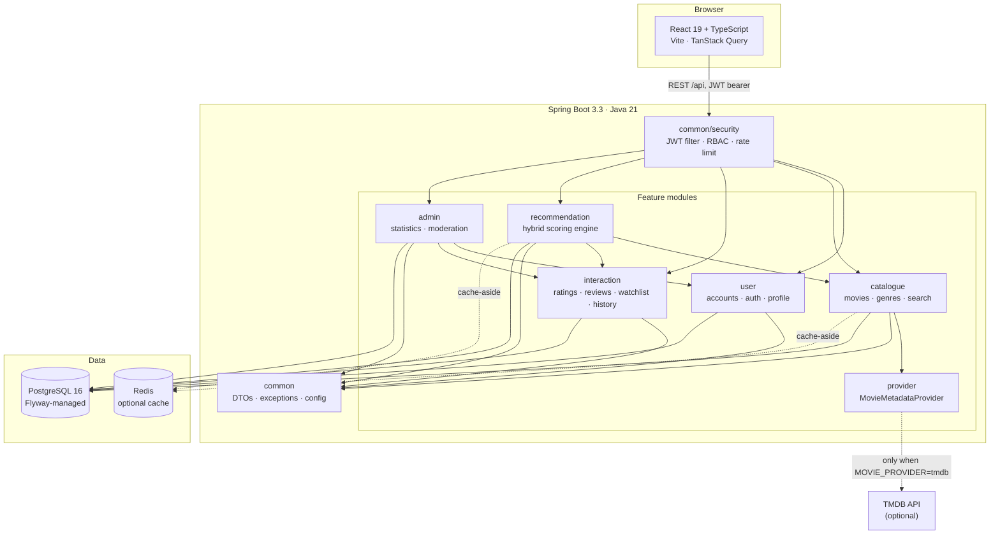
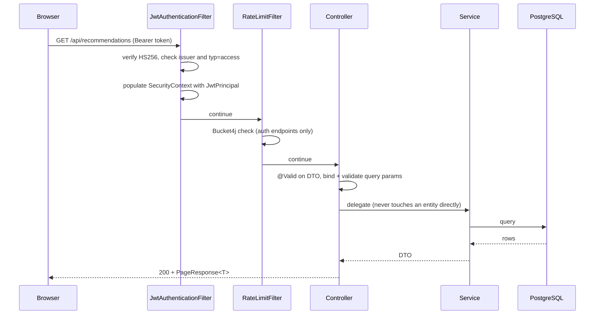

# Architecture

CineVault is a **modular monolith**: one deployable Spring Boot application,
internally divided into feature modules with enforced boundaries. This document
explains the structure and, more importantly, why it is shaped this way.

## Why a monolith

Microservices are the reflexive answer for a system like this, and they would be
the wrong one. The dominant workload is the recommendation engine, which needs
a user's ratings, watch history, watchlist and the movie catalogue **together**,
in one query plan, to score a few hundred candidates in a single request. Split
across services, that becomes a fan-out of network calls per page load, and the
joins that PostgreSQL does in milliseconds turn into application-level merges.

The modules below are separated by package and dependency direction rather than
by process boundary. If one of them ever genuinely needs independent scaling,
the seam is already there to extract it.

## Module map

### Dependency rules

- `common` depends on nothing internal. Everything may depend on it.
- `recommendation` reads from `catalogue` and `interaction` but neither knows it
  exists — recommendations are derived data, so the dependency only points one way.
- `provider` is the only package permitted to make outbound HTTP calls.
- No module reaches into another's repositories; access is through services.

## Request lifecycle

Any exception raised on this path is converted by `GlobalExceptionHandler` into
the single `ApiError` shape. There is no second error format anywhere in the API.

## Layering

Each module follows the same internal layering, and the rules are absolute:

| Layer | Responsibility | May not |
| --- | --- | --- |
| `web/` | HTTP concerns: status codes, binding, validation | Contain business logic |
| `service/` | Business rules, transactions, authorisation checks | Know about HTTP |
| `repository/` | Data access, query definitions | Contain business rules |
| `domain/` | JPA entities and invariants | Leak outside the module |
| `dto/` | The API contract | Reference entities |

**Entities never cross the web boundary.** Every response is a DTO. This is not
ceremony: it prevents a lazy-loading proxy from being serialised mid-transaction,
stops schema changes from silently becoming breaking API changes, and means a
field cannot be exposed by accident just because someone added a column.

## Key design decisions

### Stateless authentication

Access tokens are short-lived signed JWTs; refresh tokens are opaque 256-bit
random values stored **only** as SHA-256 digests. A database leak therefore
yields no usable session.

Refresh rotates on every use. Presenting an already-rotated token is treated as
theft and revokes the user's entire token family — the standard mitigation for
refresh-token replay. The frontend consequently must never issue two concurrent
refreshes, which is why its HTTP client single-flights them through one shared
promise (a behaviour covered by a mutation-tested unit test).

### Aggregates maintained by a database trigger

`movies.average_rating` and `movies.rating_count` are maintained by the trigger
`ratings_refresh_aggregate`, not by application code. Ratings arrive from several
paths, and any of them forgetting to update the aggregate would corrupt it
permanently. The database is the only place that can guarantee the invariant.

The consequence is mapped explicitly: those columns are
`@Column(insertable = false, updatable = false)`, and after writing a rating the
service re-reads them through a projection, because Hibernate's first-level cache
would otherwise hand back pre-trigger values. This is verified by an integration
test against real PostgreSQL.

### Caching is an optimisation, never a source of truth

Redis is optional. If `CACHE_ENABLED=false` or Redis is unreachable, the
application falls back to an in-memory cache and keeps working; the Redis health
indicator is deliberately disabled so a missing cache cannot mark the service
unhealthy. Every cache entry has a TTL and nothing is stored there that cannot be
recomputed from PostgreSQL.

### The external provider is an abstraction, not a dependency

`MovieMetadataProvider` has two implementations: `LocalMovieMetadataProvider`
(the seeded catalogue) and `TmdbMovieMetadataProvider`. The default is `local`,
so **the application runs fully with no API key and no internet access**. If
`MOVIE_PROVIDER=tmdb` is set without a key, it logs a warning and falls back to
local rather than failing to start.

### Virtual threads

Java 21 virtual threads are enabled. The workload is I/O-bound — the request
thread spends most of its life waiting on PostgreSQL — which is precisely the
case they were designed for, and it avoids the complexity cost of making the
whole stack reactive.

## Security posture

- Deny-by-default authorisation; every endpoint is explicitly opened.
- `/api/admin/**` and non-health actuator endpoints require `ROLE_ADMIN`.
- BCrypt strength 12 for passwords; password policy enforced server-side, since
  client-side validation is a usability feature and not a control.
- Login returns an identical message and does comparable work for an unknown
  account and a wrong password, so it cannot be used to enumerate accounts.
- CSRF is disabled because the API is stateless and token-based; there is no
  ambient credential for an attacker's site to leverage.
- CSP, HSTS and frame-deny headers are set; CORS uses an explicit allowlist.
- No secret has a default value. `JWT_SECRET` is required and must decode to at
  least 32 bytes, or the application refuses to start.

## Frontend architecture

- **Server state** lives in TanStack Query, **URL state** in the router, and only
  genuinely local UI state in React state. Discovery filters live in the URL, so
  a filtered view is shareable and survives a refresh.
- Route-level code splitting: the initial bundle is ~70 kB gzipped, with each
  route loaded on demand.
- The API client attaches bearer tokens, classifies failures into a typed
  `ApiError`, and transparently refreshes and replays a request that fails with
  401 — once, guarded by a `_retried` marker so a genuine 401 cannot loop.
- Accessibility is treated as a requirement: the search field is a proper ARIA
  combobox, the star control is a `radiogroup`, dialogs use native `<dialog>`,
  and interactive state is conveyed with `aria-pressed` rather than colour alone.
