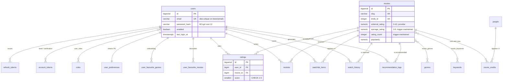

# Database

PostgreSQL 16, schema managed exclusively by Flyway. Hibernate runs with
`ddl-auto: validate` — it verifies that the entities match the schema and
**never modifies it**. The migrations are the single source of truth.

Every fact in this document was obtained by introspecting a live PostgreSQL 16
instance after applying the migrations and seed scripts.

## Migrations

| Version | Purpose |
| --- | --- |
| `V1__create_auth_schema.sql` | `users`, `roles`, `user_roles`, `refresh_tokens`, `account_tokens` |
| `V2__create_catalogue_schema.sql` | `movies`, `genres`, `people`, `keywords` and their join tables |
| `V3__create_interaction_schema.sql` | `ratings`, `reviews`, `watchlist_items`, `watch_history`, preferences, `recommendation_logs` |
| `V4__create_rating_aggregate_trigger.sql` | Trigger maintaining `movies.average_rating` / `rating_count` |

Repeatable seed scripts live in `db/seed/` and are only loaded under the `dev`
and `integration` profiles:

| Script | Contents |
| --- | --- |
| `R__seed_catalogue.sql` | 61 movies, 18 genres, 253 people, 240 keywords, 346 credits |
| `R__seed_demo_activity.sql` | 7 demo users, 43 ratings, 172 history rows, 9 watchlist items, 5 reviews |

Totals: **20 tables, 62 indexes, 25 foreign keys.**

## Entity relationships



## Enforced invariants

Correctness is enforced by the database, not only by application code. An
application bug, a bad migration or a manual `psql` session cannot corrupt these.

### Check constraints

| Constraint | Rule |
| --- | --- |
| `ck_ratings_score` | `score BETWEEN 1 AND 5` |
| `ck_movies_avg_rating` | `average_rating BETWEEN 0 AND 5` |
| `ck_movies_ext_rating` | `external_rating BETWEEN 0 AND 10` |
| `ck_movies_runtime` | `runtime_minutes IS NULL OR > 0` |
| `ck_watch_history_progress` | `progress_percent IS NULL OR BETWEEN 0 AND 100` |
| `ck_ufg_weight` | `weight > 0 AND weight <= 1` |
| `ck_watch_history_type` | One of the six interaction types |
| `ck_recommendation_logs_type` | One of the six recommendation types |
| `ck_reviews_status` | `PUBLISHED`, `HIDDEN`, `FLAGGED` |
| `ck_movies_status` | `RELEASED`, `UPCOMING`, `IN_PRODUCTION`, `CANCELLED` |
| `ck_movie_credits_type` | `CAST`, `DIRECTOR`, `WRITER`, `PRODUCER` |
| `ck_account_tokens_type` | `PASSWORD_RESET`, `EMAIL_VERIFICATION` |
| `ck_user_preferences_theme` | `light`, `dark`, `system` |

Status and type columns use `VARCHAR` + `CHECK` rather than native PostgreSQL
enums, because adding a value to a native enum requires `ALTER TYPE` and cannot
run inside a transactional migration on older versions. A check constraint is
edited with an ordinary, reversible migration.

### Uniqueness

| Index | Guarantees |
| --- | --- |
| `uq_ratings_user_movie` | One rating per user per film |
| `uq_reviews_user_movie` | One review per user per film |
| `uq_watchlist_user_movie` | No duplicate watchlist entries |
| `uq_users_email` + `idx_users_email_lower` | Email unique, **case-insensitively** |
| `uq_refresh_tokens_hash` | Token digests are unique |
| `uq_movies_slug`, `uq_movies_tmdb` | Stable identity for upserts |
| `uq_movie_credits` | No duplicate credit rows |

Two notes on the harder cases:

- **Case-insensitive email** needs a *functional* index on `lower(email)`. A
  plain unique constraint would happily accept `Ada@example.com` alongside
  `ada@example.com`.
- **`uq_movie_credits`** covers `(movie_id, person_id, credit_type,
  COALESCE(job,''), COALESCE(character_name,''))`. It must be a
  `CREATE UNIQUE INDEX`: PostgreSQL rejects expressions such as `COALESCE(...)`
  inside a table-level `UNIQUE` constraint. Without the `COALESCE` wrappers,
  `NULL != NULL` would let unlimited duplicate rows through.

## The rating aggregate trigger

`movies.average_rating` and `movies.rating_count` are maintained by
`ratings_refresh_aggregate`, which fires on `INSERT`, `UPDATE` and `DELETE`.

Ratings are written from several code paths; if any one of them forgot to update
the aggregate, it would drift permanently and silently. Only the database can
guarantee the invariant for every writer.

Verified behaviour against real PostgreSQL:

```
initial state                     → 4.75 / 4
insert a 3-star rating            → 4.40 / 5
update that rating to 5 stars     → 4.80 / 5   (count unchanged)
delete both test ratings          → back to the original count
```

Two consequences the application must respect:

1. The entity maps both columns `insertable = false, updatable = false`.
2. The trigger fires **inside** the writing transaction, but Hibernate's
   first-level cache does not know that. After writing a rating the service
   re-reads the values through the `findRatingAggregate` projection, which
   bypasses the cache. An integration test asserts this.

## Indexing strategy

62 indexes, each justified by a query the application actually runs. Four were
confirmed to be *used* by inspecting `EXPLAIN` output rather than assumed:

| Index | Serves |
| --- | --- |
| `idx_movies_popularity` | Default discovery sort |
| `idx_movies_title_lower` | Case-insensitive title search and type-ahead |
| `idx_movie_genres_genre` | Genre browsing (reverse lookup) |
| `idx_watch_history_user_time` | A user's history, newest first |

Composite indexes lead with the equality column and follow with the sort column,
so PostgreSQL can satisfy filter and ordering from one index scan.

## Deletion semantics

User-owned data cascades: deleting a user removes their ratings, reviews,
watchlist, history, preferences and tokens. Verified by test, including that the
rating aggregate is refreshed afterwards, so a deleted account does not leave
inflated rating counts behind.

Catalogue data does **not** cascade from user actions — deleting a rating never
deletes a film.

## Security-relevant storage

- Passwords: BCrypt, cost 12. Never logged, never returned by any endpoint.
- Refresh tokens: stored **only** as a SHA-256 hex digest (`CHAR(64)`). The raw
  token exists solely in the response body and the client's storage, so a
  database leak yields no usable sessions.
- Password-reset and email-verification tokens: same digest treatment, in
  `account_tokens`, with a 30-minute and 3-day TTL respectively.
- Plain SHA-256 is correct here rather than BCrypt: the input is 256 bits of
  cryptographic randomness, so it is not brute-forceable, and a slow KDF would
  add latency to every token refresh for no security gain.

## Verifying the schema locally

Without Docker or a local PostgreSQL install:

```bash
tools/offline-verify/run-verification.sh
```

This boots a real PostgreSQL 16, applies every migration and seed script, and
runs 20 behavioural checks covering the trigger, the constraints, cascade
behaviour and index usage.
