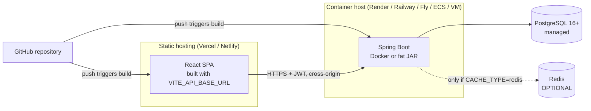

# Deployment

How to run CineVault outside a developer laptop. Nothing here assumes a
specific vendor beyond what has been verified; where a provider is named it is
because its build contract is documented and stable.

> **Status.** These instructions were written against the real configuration
> and validated statically (YAML/JSON/TOML parsed, env-var coverage checked
> programmatically, production bundle built and inspected). They have **not**
> been executed end to end against live cloud infrastructure — the build
> environment has no Docker, no JVM and no network access to Maven Central.
> Treat the first deployment as a smoke test and follow the
> [verification checklist](#post-deployment-verification).

## Architecture



Two independent deployables. The frontend is static files; the backend is a
normal long-running JVM process. They are joined only by
`VITE_API_BASE_URL` (frontend → backend) and `CORS_ALLOWED_ORIGINS`
(backend → frontend). **Both must be set, and they must agree**, or the browser
will block every request.

> **Do not try to host Spring Boot on Vercel.** Vercel runs short-lived
> serverless functions; this application holds a JDBC connection pool, runs
> Flyway at startup and keeps an in-process cache. It needs a container or a
> persistent JVM host.

---

## 1. Database

### Requirements

| Item | Requirement |
| --- | --- |
| Engine | PostgreSQL **16+** (developed and verified on 16.2) |
| Extensions | **None.** No PostGIS, no pgvector, no `uuid-ossp` |
| Minimum size | 1 vCPU / 1 GB is ample for the seeded catalogue |
| Connections | `max_connections` ≥ `DB_POOL_SIZE` × instances, plus headroom |
| Encoding | UTF-8 (the default on every managed provider) |

Any managed PostgreSQL works: Neon, Supabase, RDS, Cloud SQL, Render
PostgreSQL, Railway. Nothing vendor-specific is used.

Version 16 is a genuine floor, not a preference — the schema uses expression
based unique indexes and `CREATE INDEX ... WHERE` partial indexes, and the
migrations are only tested on 16.

### Migrations

Flyway runs automatically at startup, inside the application:

- `spring.flyway.enabled=true` — migrations apply before the app serves traffic.
- `spring.jpa.hibernate.ddl-auto=validate` — Hibernate **never** alters the
  schema; it only verifies the entities match. A mismatch fails startup loudly.
- `spring.flyway.clean-disabled=true` under `prod` — `flyway:clean` cannot drop
  a production database even if invoked by accident.

You do **not** run migrations manually. Deploy the new version and it migrates
itself. On a multi-instance rollout the first instance acquires Flyway's lock
and the others wait, so concurrent startup is safe.

| Migration | Contents |
| --- | --- |
| `V1` | Users, roles, refresh tokens, account tokens |
| `V2` | Movies, genres, people, keywords, join tables |
| `V3` | Ratings, reviews, watchlist, history, preferences |
| `V4` | Rating-aggregate trigger |
| `V5` | Partial indexes for the top-rated and new-release rails |

### Seed data

Seeding is controlled by **which Flyway locations are on the path**, not by a
boolean flag:

| Profile | Locations | Result |
| --- | --- | --- |
| `dev` | `db/migration` + `db/seed` | 61 films, 18 genres, 7 demo accounts |
| `prod` | `db/migration` only | Schema and reference data only — **no demo accounts** |

This is deliberate. A flag can be misread; excluding the location entirely means
the demo users **cannot** be created in production even by misconfiguration.

The seed scripts are repeatable (`R__`) and idempotent (`ON CONFLICT DO
NOTHING`), so re-running them is safe.

> The seeded demo password (`DemoPassw0rd!`) is a documented development-only
> credential. It exists solely in `db/seed`, which production never loads.

### Production considerations

- **Backups.** Enable automated snapshots. The catalogue is reproducible from
  seed, but user accounts, ratings and reviews are not.
- **Connection limits.** Serverless PostgreSQL (Neon, Supabase) caps
  connections aggressively — keep `DB_POOL_SIZE` at 5–10 per instance and use
  the provider's pooled connection string if offered.
- **TLS.** Append `?sslmode=require` to `DATABASE_URL` if the provider does not
  enforce it.
- Never put credentials in `DATABASE_URL` in source control; inject the whole
  URL as a secret.

---

## 2. Redis — optional

**Redis is not required for a first production deployment.** The default
`CACHE_TYPE=memory` uses an in-process cache and the application is fully
functional without any Redis instance.

| | `memory` (default) | `redis` |
| --- | --- | --- |
| Extra infrastructure | none | a Redis instance |
| Cache shared across instances | no | yes |
| Survives a restart | no | yes |
| Correct for | 1 instance | 2+ instances |

What it actually accelerates: trending and popular rails (15/30 min), the genre
list (6 h), search suggestions (10 min), personalised recommendations (5 min)
and upstream TMDB metadata (1–24 h). It does nothing for watchlists, ratings or
anything user-specific — those are never cached.

Enable it only when you run more than one instance, or when cold-start latency
after a restart becomes a real complaint:

```bash
CACHE_TYPE=redis
REDIS_URL=redis://:password@host:6379
CACHE_TYPE_REDIS_HEALTH=true   # only once Redis is genuinely required
```

Leave `CACHE_TYPE_REDIS_HEALTH=false` while caching is in-memory, otherwise the
health endpoint reports DOWN for a dependency the app does not use — which will
make your platform kill a perfectly healthy container.

Locally, Redis is behind a compose profile:

```bash
docker compose up --build                  # Postgres + backend + frontend
docker compose --profile redis up --build  # ... and Redis
```

---

## 3. Backend deployment

A conventional Spring Boot service. Two supported shapes:

### Option A — Docker (recommended)

```bash
docker build -f docker/Dockerfile.backend -t cinevault-backend .
docker run -p 8080:8080 --env-file .env cinevault-backend
```

The image is multi-stage: Maven builds the jar, and the runtime layer is
`eclipse-temurin:21-jre-alpine` with a non-root user. It sets
`-XX:MaxRAMPercentage=75` so the JVM sizes its heap from the *container* limit
rather than the host's RAM, and includes a `HEALTHCHECK` against the readiness
probe.

Point your platform at `docker/Dockerfile.backend` with the **repository root**
as the build context — the Dockerfile copies `backend/`, so a context of
`backend/` will fail.

### Option B — fat JAR

```bash
cd backend && mvn -B clean package -DskipTests
java -jar target/*.jar
```

Requires **JDK 21+** (virtual threads and records are used).

| Setting | Value |
| --- | --- |
| Build command | `cd backend && mvn -B clean package -DskipTests` |
| Start command | `java -jar target/*.jar` |
| Health check path | `/actuator/health/readiness` |
| Port | `$PORT` if injected, else `SERVER_PORT`, else `8080` |
| Minimum memory | 512 MB; 1 GB comfortable |

### Port binding

Hosts that inject a port (Render, Railway, Heroku, Cloud Run) are handled
automatically — `server.port` resolves `${PORT:${SERVER_PORT:8080}}`, so `PORT`
wins when present and nothing needs configuring.

### Health checks

| Endpoint | Answers | Use for |
| --- | --- | --- |
| `/actuator/health/liveness` | Is the process broken? | Restart policy |
| `/actuator/health/readiness` | Can it serve traffic? | Load-balancer gate |
| `/actuator/health` | Aggregate | Dashboards |

The distinction matters. Readiness **includes** the database, so an instance is
pulled from the load balancer during a database outage. Liveness **excludes**
it, so the container is not restarted — restarting fixes nothing and produces a
crash-loop that turns a brief outage into a long one.

Allow a generous start period (≈90 s): the first boot runs Flyway.

### Startup and shutdown

Startup is ordered: Flyway migrates, Hibernate validates, then the port opens.
The instance never serves traffic against an un-migrated schema.

Shutdown is graceful, with `SHUTDOWN_TIMEOUT` (default 25 s) for in-flight
requests to finish. Set your platform's termination grace period **higher** than
this, or it will `SIGKILL` mid-drain.

### Production logging

Under `prod`: root at `WARN`, application at `INFO`, plain text to stdout for
the platform to collect. Hibernate SQL and parameter binding are pinned to
`WARN` so query values never reach the logs.

Never set `LOG_LEVEL=DEBUG` in production. Errors carry an 8-character
`correlationId` returned to the client and written to the log, so a user report
can be traced without exposing stack traces.

### Transactional email — required in production

The bundled `LoggingNotificationSender` writes password-reset links to the log
and is **disabled under the `prod` profile**, because a reset token is a bearer
credential and logging it would copy account access into every log aggregator.

`NotificationSenderGuard` therefore **fails startup** under `prod` if no real
sender bean exists, with an explicit message. Supply an implementation of
`com.cinevault.user.service.NotificationSender` (SMTP, SES, SendGrid,
Postmark…) as a Spring bean. Password reset and email verification cannot
function without one.

This is intentional: a loud startup failure is better than silently broken
password reset, or silently leaked credentials.

---

## 4. Frontend deployment

The frontend deploys standalone from `frontend/`. It does not need the backend
in the same runtime — only a reachable URL.

`VITE_API_BASE_URL` is inlined **at build time**. Changing it requires a
rebuild; setting it in a runtime environment panel after the fact has no effect.

### Option A — Vercel

`frontend/vercel.json` is committed and covers SPA rewrites, immutable asset
caching and security headers.

1. New Project → import the repository.
2. **Root Directory:** `frontend`
3. Framework preset: **Vite** (build `npm run build`, output `dist`, install `npm ci`).
4. Environment variable:
   `VITE_API_BASE_URL = https://your-backend.example.com/api`
5. Deploy, then add the resulting origin to the backend's `CORS_ALLOWED_ORIGINS`.

### Option B — Netlify

`frontend/netlify.toml` is committed with the same behaviour.

1. Add new site → import the repository.
2. **Base directory:** `frontend`
3. Build `npm run build`, publish `frontend/dist`.
4. Environment variable: `VITE_API_BASE_URL = https://your-backend.example.com/api`
5. Deploy, then update `CORS_ALLOWED_ORIGINS`.

### SPA routing

Both configs rewrite unknown paths to `index.html`. Without this, refreshing on
`/movies/42` returns 404 — the host looks for a file that does not exist.

The rewrite deliberately excludes `/assets/*` and any path with a file
extension, so real files are served rather than silently replaced by HTML. This
was verified against the actual built asset filenames.

### Caching

Hashed assets are `immutable, max-age=31536000`; `index.html` is
`no-cache, must-revalidate`. That combination is what makes deploys safe: a
client always fetches a fresh `index.html`, which then references the new asset
hashes.

### Same-origin alternative

Leave `VITE_API_BASE_URL` **unset** to use the relative path `/api`, and put a
reverse proxy in front of both. That is what `docker compose` does via nginx.
It avoids CORS entirely and is the simplest correct setup when you control both.

---

## 5. CORS

The single most common deployment failure. Requests work in `curl` but fail in
the browser with *"No 'Access-Control-Allow-Origin' header"*.

```bash
CORS_ALLOWED_ORIGINS=https://cinevault.vercel.app,https://www.cinevault.com
```

Rules:

- **Origins only.** Scheme + host + optional port. No trailing slash, no path.
  `https://x.com/` and `https://x.com/app` are both wrong; `https://x.com` is right.
- **Comma-separated**, no spaces required (they are trimmed).
- **Never `*`.** Credentials are enabled, and the CORS specification forbids
  wildcard-with-credentials. The browser will reject it.
- Preview deployments have **different origins** — add them, or accept that
  previews cannot reach the API.
- `http://` vs `https://` are different origins. So are `example.com` and
  `www.example.com`.

Allowed methods, headers and a 1-hour preflight cache are already configured.

---

## 6. Environment variables

Full annotated list in [`.env.example`](../.env.example); this is the deployment
subset.

### Backend — required

| Variable | Notes |
| --- | --- |
| `JWT_SECRET` | **No default.** ≥32 bytes. `openssl rand -base64 48` |
| `DATABASE_URL` | `jdbc:postgresql://host:5432/db` (add `?sslmode=require` if needed) |
| `DATABASE_USERNAME` / `DATABASE_PASSWORD` | Injected as secrets |
| `CORS_ALLOWED_ORIGINS` | Exact frontend origin(s) |
| `SPRING_PROFILES_ACTIVE` | `prod` |
| `FRONTEND_URL` | Base for links in reset/verification emails |

### Backend — optional

| Variable | Default | Notes |
| --- | --- | --- |
| `PORT` / `SERVER_PORT` | `8080` | `PORT` wins; usually injected |
| `CACHE_TYPE` | `memory` | `redis` for multi-instance |
| `REDIS_URL` | — | Only when `CACHE_TYPE=redis` |
| `CACHE_TYPE_REDIS_HEALTH` | `false` | `true` only if Redis is required |
| `MOVIE_PROVIDER` | `local` | `tmdb` needs `TMDB_API_KEY` |
| `TMDB_API_KEY` | — | Falls back to `local` with a warning if absent |
| `DB_POOL_SIZE` | `10` | Lower for serverless PostgreSQL |
| `LOG_LEVEL` | `INFO` | Never `DEBUG` in production |
| `OPENAPI_ENABLED` | `false` under `prod` | Swagger UI |
| `RATE_LIMIT_CAPACITY` | `20` | Auth requests/min per client |
| `SHUTDOWN_TIMEOUT` | `25s` | Keep below the platform grace period |

### Frontend — build time

| Variable | Notes |
| --- | --- |
| `VITE_API_BASE_URL` | Absolute backend URL **including `/api`**. Leave unset for same-origin. |

Never place a secret in a `VITE_*` variable — everything prefixed `VITE_` is
compiled into the bundle and is public.

---

## 7. Deployment order

1. **Database** — provision, note the connection string.
2. **Backend** — deploy with `DATABASE_URL`, `JWT_SECRET`,
   `SPRING_PROFILES_ACTIVE=prod`, and a placeholder `CORS_ALLOWED_ORIGINS`.
   Flyway migrates on first boot. Confirm `/actuator/health/readiness` is `UP`.
3. **Frontend** — deploy with `VITE_API_BASE_URL` pointing at the backend.
4. **Close the loop** — set `CORS_ALLOWED_ORIGINS` to the real frontend origin
   and restart the backend.
5. **Optional** — add Redis and set `CACHE_TYPE=redis` when you scale past one
   instance.

---

## Post-deployment verification

Run these in order; each one isolates a different failure.

```bash
API=https://your-backend.example.com

# 1. Readiness (proves the app booted and the database is reachable)
curl -fsS $API/actuator/health/readiness

# 2. Public catalogue (proves Flyway ran and data is queryable)
curl -fsS "$API/api/movies?size=3" | head -c 400

# 3. Anonymous recommendations (proves the engine works with no user)
curl -fsS "$API/api/recommendations/trending?size=3" | head -c 400

# 4. Registration (proves writes, BCrypt and JWT issuance)
curl -fsS -X POST $API/api/auth/register \
  -H 'Content-Type: application/json' \
  -d '{"email":"smoke@example.com","password":"Str0ngPassphrase!","displayName":"Smoke Test"}'

# 5. CORS preflight from the real frontend origin (the usual failure)
curl -fsS -i -X OPTIONS "$API/api/movies" \
  -H "Origin: https://your-frontend.example.com" \
  -H "Access-Control-Request-Method: GET" | grep -i access-control-allow-origin
```

Step 5 must echo your origin. If the header is absent, `CORS_ALLOWED_ORIGINS`
does not match — check for a trailing slash or an `http`/`https` mismatch.

In the browser, confirm: sign in, deep-link to `/movies/<id>` and refresh (SPA
routing), add to watchlist (authenticated write), and reload (JWT persisted).

---

## Troubleshooting

| Symptom | Cause | Fix |
| --- | --- | --- |
| Startup: `JWT secret must be at least 32 bytes` | Secret missing or too short | `openssl rand -base64 48` |
| Startup: `No NotificationSender bean is configured` | `prod` without a mail sender | Supply a `NotificationSender` bean |
| Startup: `Schema validation: missing table` | Flyway did not run | Check `spring.flyway.enabled` and DB permissions |
| Startup hangs, then connection timeout | DB unreachable / firewall | Check `DATABASE_URL`, SSL mode, allowlist |
| Browser: no `Access-Control-Allow-Origin` | Origin mismatch | Exact origin, no trailing slash |
| API works in curl, fails in browser | Same as above | Same as above |
| 404 on refresh at `/movies/42` | SPA rewrite missing | Deploy `vercel.json` / `netlify.toml`; set base directory to `frontend` |
| Frontend calls `localhost:8080` in production | `VITE_API_BASE_URL` unset at **build** time | Set it and **rebuild** |
| All API calls 401 after ~15 min | Refresh failing | Check clock skew; confirm `/api/auth/refresh` reachable |
| Users logged out at random | Concurrent refresh → reuse detection | Expected defence; ensure one client instance |
| Health `DOWN`, app otherwise fine | `CACHE_TYPE_REDIS_HEALTH=true` without Redis | Set it `false` |
| Container killed during deploy | Grace period < `SHUTDOWN_TIMEOUT` | Raise the platform grace period |
| Empty catalogue in production | `prod` excludes seed data (by design) | Import a catalogue, or run `POST /api/admin/catalogue/sync` with TMDB |
| `too many connections` | Pool × instances > server limit | Lower `DB_POOL_SIZE`, use a pooled URL |

---

## Security checklist before going live

- [ ] `JWT_SECRET` is freshly generated and stored as a secret, not in source.
- [ ] `SPRING_PROFILES_ACTIVE=prod` (disables Swagger and seed data).
- [ ] `CORS_ALLOWED_ORIGINS` lists exact origins; no wildcard.
- [ ] A real `NotificationSender` is wired (startup enforces this).
- [ ] TLS terminates in front of the backend (HSTS is already sent).
- [ ] `LOG_LEVEL=INFO` or higher.
- [ ] Database backups enabled.
- [ ] `OPENAPI_ENABLED` unset or `false`.
- [ ] No demo accounts exist — confirm `prod` was used from the first boot.
