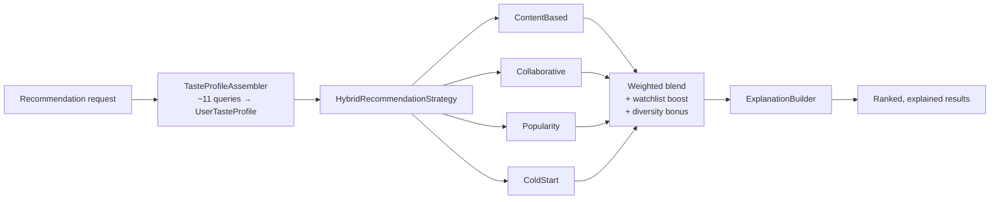

# The recommendation engine

The engine answers one question: *given everything we know about this user,
which unseen films should we show them, and can we explain why?*

Every constant below is the value in the code. Every number in the worked
examples was produced by executing the engine, not estimated.

## Design constraints

1. **No hardcoded lists.** Every recommendation is computed from real signals.
2. **Explanations must be true.** A reason is generated from the scoring
   contributions that actually fired, so the UI cannot claim "because you like
   Christopher Nolan" unless the director signal genuinely contributed.
3. **Never return an empty page.** A new user with no history still gets a
   useful home screen.
4. **Framework-free core.** The `model`, `scoring`, `strategy` and `explain`
   packages contain no Spring, JPA or Jackson imports, so the algorithm can be
   unit-tested and reasoned about in isolation. The build enforces this: the
   verification script fails if a framework import leaks in.

## Strategy pattern



Each strategy implements `RecommendationStrategy` and declares whether it
`supports(profile)`. The hybrid asks each one, then **renormalises the weights
over only those that can contribute** — so a user without enough ratings for
collaborative filtering gets a stronger content signal rather than a ranking
diluted towards generic popularity.

## The four strategies

### 1. Content-based

Scores a candidate by how well its metadata matches the user's learned
affinities. Facet weights:

| Facet | Weight | Aggregation |
| --- | --- | --- |
| Genre | 0.30 | mean |
| Keyword | 0.22 | mean |
| Director | 0.20 | peak |
| Cast | 0.15 | peak |
| Writer | 0.08 | peak |
| Language | 0.05 | direct |

Crew and cast use **peak** rather than mean affinity deliberately: a film with
one director you love and three you have never heard of should score on the one
you love, not be averaged into mediocrity. Genres use the mean, because a film
being *partly* in a genre you like is genuinely weaker evidence.

Affinities are built only from **positive** signals. A rating of 3 or below
contributes nothing, so disliking a romance never creates romance affinity. Each
affinity map is normalised by its maximum, so the strongest signal is always 1.0
regardless of how much history a user has.

### 2. Collaborative

Mean-centred cosine similarity between users, then a weighted deviation-from-mean
prediction.

Mean-centring matters: a user who rates everything 4–5 and one who rates
everything 1–2 can have identical *taste*, and raw cosine would miss it entirely.

```
similarity(u, v) = cos(centre(ratings_u), centre(ratings_v))
score(movie)     = Σ sim(u,v) · (rating_v(movie) − mean_v) / Σ |sim(u,v)|
```

Guards:

- `MIN_SIMILARITY = 0.05` — ignore noise-level neighbours.
- `MAX_NEIGHBOURS = 50` — bound the cost.
- Damping `count / (count + 8)` — a prediction from three neighbours should not
  be trusted as much as one from thirty. **Verified:** the same film scores
  0.156 with three neighbours and 0.063 with one.
- **Zero-vector neighbours are skipped.** A user who rated everything identically
  mean-centres to the zero vector, for which cosine is undefined; they express no
  relative preference and are correctly excluded. This applies to the target user
  too — if *they* have no rating variance, collaborative returns nothing.
- Requires at least 3 ratings (`COLD_START_RATING_THRESHOLD`).

### 3. Popularity

The fallback that guarantees a non-empty page.

```
score = 0.50 · quality + 0.30 · popularity + 0.20 · recency
```

- **Quality** is a *Bayesian-shrunk* rating (prior 6.5, confidence 1000), not a
  raw average. This is the difference between "a 10.0 from one voter" and "an 8.5
  from 30,000 voters". Shrinkage puts the acclaimed film on top, where it belongs.
- **Popularity** is log-normalised — raw popularity is heavily skewed.
- **Recency** decays exponentially with a 730-day half-life.

Verified on the fixture catalogue: a strong 2026 release scores **0.836**, an
acclaimed 1954 classic **0.635**, and an obscure poorly-rated film **0.430**. The
classic is ranked below the new release but stays a respectable suggestion, which
is the intended balance.

### 4. Cold start

For users below the personalisation threshold.

- With onboarding genre picks: `0.65 · genre match + 0.35 · popularity`.
- With nothing at all: popularity, then diversified.

Diversification caps how many entries may share a dominant genre
(`MAX_PER_GENRE = 3`), deferring the excess to the tail rather than discarding
it, so the result is always a permutation of the input and nothing is lost.
Verified: the top six results for a brand-new user span **six distinct genres**.

A single strong genre match is floored at 0.5 so that a broad film carrying one
wanted genre is not buried by proportional scoring alone. This is what lets a
niche declared preference beat a blockbuster: a user who picks Romance gets
*A Quiet Romance* first, ahead of far more popular films.

## Hybrid blending

Base weights, renormalised over the applicable strategies:

| Component | Weight |
| --- | --- |
| Content-based | 0.40 |
| Collaborative | 0.35 |
| Popularity | 0.15 |
| User preference | 0.10 |

Worked example, verified by execution — a user with a single rating cannot
support collaborative filtering, so the weights become:

```
{CONTENT_BASED = 0.727, POPULARITY = 0.273}
```

The content weight *rises* from 0.40 to 0.727 rather than the ranking collapsing
towards popularity. A user with no signals at all resolves to
`{POPULARITY = 1.0}`.

Two adjustments are then applied:

- **Watchlist boost (+0.05).** Saving a film is an explicit intent signal.
  Verified: the same film scores 0.329 unsaved and 0.386 saved.
- **Diversity bonus (`0.04 / (1 + seen)`).** A small nudge that prevents the
  first page from being ten variations of one theme.

## Explanations

`ExplanationBuilder` inspects the `SignalContribution` list attached to each
scored film and describes the **strongest** one, using a two-tier approach:

1. If a personal signal cleared `MIN_PERSONAL_STRENGTH = 0.05`, name it
   concretely: *"Because you liked movies directed by Christopher Nolan"*.
2. Otherwise fall back to an honest generic reason for the strategy that
   produced it — *"Popular with viewers right now"*, *"A well-loved title to get
   you started"*.

The fallback exists so the engine never invents a personal reason it cannot
support. There is a fallback string for every `RecommendationType`, and a test
asserts none is blank.

## Similar films

`/api/recommendations/similar/{id}` does not consult the user profile, so it
works for anonymous visitors:

```
similarity = 0.35·genre + 0.30·keyword + 0.15·cast + 0.15·director + 0.05·language
final      = 0.85·similarity + 0.15·shrunkQuality
```

Set overlaps use the Jaccard index, which penalises breadth — a film tagged with
twelve genres should not look similar to everything.

The light quality tilt breaks ties sensibly: among equally similar films, the
better-regarded one wins.

**If nothing is genuinely similar, the endpoint returns an empty list.** A film
sharing no genre, keyword, cast member, director or language with anything in the
catalogue produces no results rather than padding the list with weak matches.

## Cold-start handling by scenario

| User state | Path taken | Outcome |
| --- | --- | --- |
| Brand new, no data | Cold start → popularity + diversity | 14 results, 6 distinct genres in the top 6 |
| Onboarding genres only | Cold start → genre-weighted | Declared genre ranked first |
| 1 rating | Content (0.727) + popularity (0.273) | Thematically related films |
| 3+ ratings | Full hybrid | All components active |
| Profile matching nothing | Content contributes nothing; popularity floor | Still a full page, still explained |

## Performance

- `TasteProfileAssembler` builds the whole profile in ~11 queries, not per-movie.
- `MovieFeatureLoader` loads all candidate metadata in 3 queries.
- The candidate pool is capped at 500 films.
- Scoring is O(candidates × facets) in memory — no database access inside the
  scoring loop.
- `recordServed` runs in a `REQUIRES_NEW` transaction and only for page 0, so
  telemetry can never roll back a user's actual response.

## Verification

The engine core is compiled and executed by
`tools/offline-verify/run-verification.sh`, which runs **111 assertions** across
the similarity primitives and all recommendation scenarios. The JUnit suite in
`backend/src/test/java/com/cinevault/recommendation/` covers the same ground with
JUnit 5 and AssertJ, and its expected values were obtained by executing the real
strategy classes rather than by estimation — a process that caught three
incorrect assumptions before they became failing tests.
